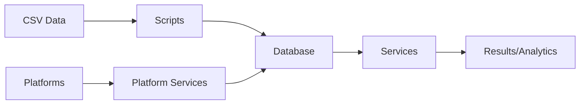

# 🏗️ System Architecture

> Welcome to the blueprint of our awesome tracking system! 🎨 Let's see how all the pieces fit together.

## 🌟 Overview

Pyramid-Tracker is built with a modular, extensible architecture that makes it easy to add new features and platforms. Think of it as a LEGO set for competitive programming tracking! 🧱

```
Pyramid-Tracker/
├── core/           # 🧠 Core components
├── platforms/      # 🌐 Platform integrations
├── db/            # 💾 Database operations
├── utils/         # 🔧 Utility functions
├── scripts/       # 🛠️ Automation scripts
└── services/      # 🔌 Business logic
```

## 🎯 Key Components

### 1️⃣ Core Module (`core/`)

The brain of our operation! 🧠

```python
core/
├── constants.py    # Enums and constants
├── config.py       # Configuration management
├── logging.py      # Structured logging
└── exceptions.py   # Custom exceptions
```

Key responsibilities:
- 📝 Configuration management
- 🎯 Constants and enumerations
- 📊 Logging setup
- ❌ Error handling

### 2️⃣ Platform Module (`platforms/`)

Where we talk to different coding platforms! 🌐

```python
platforms/
├── base.py         # Abstract base classes
├── codechef/       # CodeChef integration
├── codeforces/     # Codeforces integration
└── ...            # Other platforms
```

Features:
- 🔄 Rate limiting
- 🔒 Authentication
- 📡 API communication
- 🧮 Rating calculations

### 3️⃣ Database Module (`db/`)

Our data vault! 💾

```python
db/
├── client.py       # MongoDB client
├── models.py       # Data models
└── repositories.py # Data access
```

Capabilities:
- 🔌 Connection pooling
- 📊 Data modeling
- 🔍 CRUD operations
- 📈 Batch processing

### 4️⃣ Utils Module (`utils/`)

The Swiss Army knife! 🔧

```python
utils/
├── df_utils.py     # DataFrame operations
├── leetcode_utils.py # LeetCode helpers
└── ...            # Other utilities
```

Features:
- 🧹 Data cleaning
- 🔄 Format conversion
- 🎯 Platform-specific helpers

### 5️⃣ Scripts Module (`scripts/`)

Automation central! 🤖

```python
scripts/
└── upload_participants.py  # Data upload automation
```

Capabilities:
- 📤 Bulk data upload
- ✅ Data verification
- 🔄 Format conversion

### 6️⃣ Services Module (`services/`)

Business logic central! 🏢

```python
services/
├── leaderboard.py   # Ranking logic
└── evaluation.py    # Performance evaluation
```

Features:
- 📊 Rating calculations
- 🏆 Leaderboard generation
- 📈 Performance analysis

## 🔄 Data Flow

Here's how data flows through our system:



1. 📥 Data ingestion through scripts
2. 💾 Storage in MongoDB
3. 🌐 Platform data collection
4. 🔄 Processing and analysis
5. 📊 Results generation

## 🔌 Integration Points

### Platform Integration

Adding a new platform? Here's what you need:

```python
# 1. Add platform enum
class Platform(Enum):
    NEW_PLATFORM = "NewPlatform"

# 2. Create platform Client
class NewPlatformClient(BasePlatformClient):
    async def authenticate(self):
        # Implementation
    async def get_participant_data(self):
        # Implementation

# 3. Create platform Service
class NewPlatformService(BasePlatformService):
    async def get_participant_data(self):
        # Implementation
    async def process_batch(self):
        # Implementation

# 4. Any utility functions can be added in utils/ with the name new_platform_utils.py
def extract_new_platform_rating(data):
    # Implementation
```

### Database Integration

Working with data:

```python
# Repository pattern
class ParticipantRepository:
    def get_all_participants(self):
        # Implementation
```

## 🏗️ Design Patterns

We use several design patterns:

1. 🏭 **Factory Pattern**
   ```python
   def create_platform_service(platform: Platform) -> BasePlatformService:
       # Service factory
   ```

2. 🎭 **Repository Pattern**
   ```python
   class ParticipantRepository:
       # Data access abstraction
   ```

3. 🔄 **Singleton Pattern**
   ```python
   class DatabaseClient:
       # Single database connection
   ```

## 🔒 Security

Security measures in place:

1. 🔑 **API Authentication**
   - Secure credential storage
   - Token management

2. 🛡️ **Rate Limiting**
   ```python
   # Rate limit decorator
   @rate_limit(calls=2, period=1)
   async def api_call(self):
       # Protected API call
   ```
   **For platform clients, rate limiting is already implemented through the `BasePlatformClient` class.**

3. 🔐 **Data Protection**
   - Environment variable security
   - MongoDB authentication

## 🚀 Performance Optimizations

1. 💨 **Connection Pooling**
   ```python
   client = MongoClient(maxPoolSize=50)
   ```

2. 🔄 **Async Operations**
   ```python
   async def process_batch(participants):
       # Concurrent processing
   ```

3. 📊 **Batch Processing**
   ```python
   def bulk_update(participants):
       # Efficient updates
   ```

Remember: Good architecture is like a good joke - it should be easy to understand and work reliably! 😉 