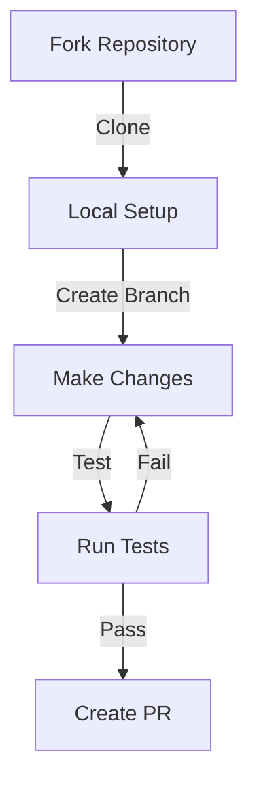
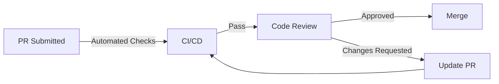

# 🤝 Contributing to Pyramid-Tracker

Welcome to the Pyramid-Tracker contributor's guide! We're super excited that you want to help make our project even more awesome! 🌟

## 🎯 Ways to Contribute

### 1️⃣ Code Contributions



#### Setting Up Your Dev Environment 🛠️

1. Fork the repository
2. Clone your fork:
   ```bash
   git clone https://github.com/your-username/Pyramid-Tracker.git
   cd Pyramid-Tracker
   ```
3. Create a virtual environment:
   ```bash
   python -m venv venv
   source venv/bin/activate  # or `venv\Scripts\activate` on Windows
   ```
4. Install dependencies:
   ```bash
   pip install -r requirements.txt
   ```

#### Making Changes 🔧

1. Create a new branch:
   ```bash
   git checkout -b feature/awesome-feature
   ```
2. Make your changes
3. Run the application to see if it works
4. Commit your changes
5. Push your changes to your fork
6. Create a PR

### 2️⃣ Bug Reports 🐛

Found a bug? We want to squash it! 🔨 When reporting bugs:

1. Check if the bug is already reported
2. Use our bug report template
3. Include:
   - Steps to reproduce
   - Expected behavior
   - Actual behavior
   - Screenshots (if applicable)
   - Environment details

### 3️⃣ Feature Requests 💡

Got an idea? We'd love to hear it! When suggesting features:

1. Check if it's already suggested
2. Use our feature request template
3. Explain the problem you're solving
4. Describe the solution you'd like
5. Consider alternatives you've thought about

## 🎨 Code Style Guide

We keep our code clean and tidy! Here's how:

### Python Style 🐍

```python
# YES! 👍
def calculate_rating(participant: Participant) -> float:
    """Calculate participant's rating.
    
    Args:
        participant: The participant object
        
    Returns:
        float: The calculated rating
    """
    return sum(p.rating for p in participant.platforms.values())

# NO! 👎
def calc_rat(p):
    return sum([x.rating for x in p.platforms.values()])
```

### Commit Messages 📝

```
# YES! 👍
feat(platforms): add support for LeetCode tracking
fix(db): resolve connection timeout issues
docs(readme): update installation steps

# NO! 👎
fixed stuff
updated code
```


### Test Coverage 📊

- Aim for 80%+ coverage
- Write tests for new features
- Include edge cases
- Test error scenarios

## 📚 Documentation

Help us keep our docs awesome! When updating docs:

1. Follow the existing tone (fun and friendly!)
2. Include code examples
3. Add emojis for visual appeal
4. Update the table of contents

## 🚀 Pull Request Process

1. 📝 Fill out the PR template
2. 🔗 Link related issues
3. ✅ Ensure all tests pass
4. 📚 Update documentation
5. 👀 Wait for review
6. 🎉 Get merged!

## 🤔 Need Help?

- 💬 Join our discussions
- 🎫 Check existing issues
- 📧 Contact maintainers
- 🌟 Star the repo (it makes us happy!)

## 🎖️ Recognition

Contributors get:
- 🏆 Name in CONTRIBUTORS.md
- 🌟 Mention in release notes
- 💪 Eternal gratitude
- 🎉 Good karma

## 🔄 Review Process



## 🎯 Project Goals

1. 🚀 Make competitive programming tracking fun
2. 📊 Provide accurate insights
3. 🤝 Build a helpful community
4. 🔧 Keep the code maintainable


## 🏃‍♂️ Performance Guidelines

1. 🚀 Use async where appropriate
2. 📊 Batch database operations
3. 🔄 Implement caching
4. 🎯 Profile before optimizing

## 🛡️ Security Guidelines

1. 🔒 Never commit secrets
2. 🔑 Use environment variables
3. 🛡️ Validate all inputs
4. 🔐 Follow OWASP guidelines

---

Remember: The best code is written with love! ❤️ 

Happy coding! 🚀✨